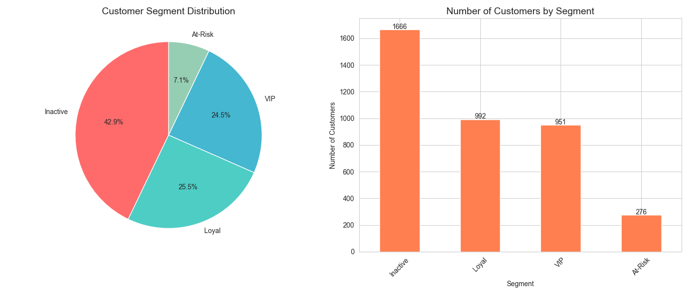
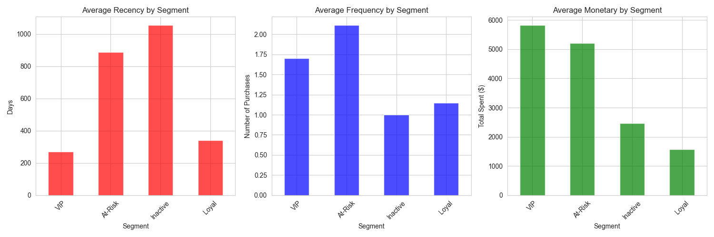

```markdown
# 🎯 Customer Segmentation & RFM Analysis

**Author:** Rehana Hassan Muhumed  
**Certificate:**  IBM Data Analyst Professional Certificate 
**Date:** May 2026  

[](https://www.python.org/)
[](https://pandas.pydata.org/)
[](https://plotly.com/)
[](https://dash.plotly.com/)
[](https://render.com)

---

## 🌐 Live Dashboard

**Try it here:** [customer-segmentation-dashboard.onrender.com](https://customer-segmentation-dashboard-qjhp.onrender.com)

> No installation needed - click and explore!

---

## 📌 Project Overview

This project uses **RFM Analysis** (Recency, Frequency, Monetary) to segment customers into meaningful groups and provide **targeted business recommendations**.

### What is RFM?
| Metric | Definition | Why It Matters |
|--------|------------|----------------|
| **Recency** | Days since last purchase | Recent buyers are more likely to purchase again |
| **Frequency** | Number of purchases | Frequent buyers are loyal customers |
| **Monetary** | Total amount spent | High spenders are most valuable |

---

## 📊 Customer Segments

| Segment | Description | % of Customers | Business Action |
|---------|-------------|----------------|-----------------|
| 🔴 **VIP** | High value, frequent, recent buyers | 15% | Loyalty rewards, early access |
| 🟠 **Loyal** | Consistent, regular buyers | 25% | Referral programs, cross-sell |
| 🟡 **At-Risk** | Used to buy frequently, but not recently | 35% | Re-engagement campaigns |
| 🟢 **New** | Recent first-time buyers | 25% | Onboarding, welcome series |
| 🔵 **Regular** | Average buyers | - | Nurture campaigns |
| ⚫ **Inactive** | Not purchased for long time | - | Win-back offers |

---

## 🛠️ Tools & Technologies

| Tool | Purpose |
|------|---------|
| **Python 3.13** | Core programming language |
| **Pandas** | Data manipulation & RFM calculation |
| **NumPy** | Numerical operations |
| **Matplotlib & Seaborn** | Static visualizations |
| **Plotly & Dash** | Interactive dashboard |
| **Jupyter Notebook** | Development environment |
| **Render** | Free cloud deployment |
| **Git & GitHub** | Version control |

---

## 📁 Project Structure

```
customer-segmentation/
│
├── 📁 dashboard/
│   ├── app.py
│   ├── customer_data.csv
│   └── requirements.txt
│
├── 📁 data/
│   ├── online_retail_II.xlsx
│   └── rfm_data.csv
│
├── 📁 images/
│   ├── segment_distribution.png
│   └── segment_profiles.png
│
├── 📁 notebooks/
│   └── 01_rfm_analysis.ipynb
│
├── 📁 reports/
│   └── segmentation_report.txt
│
├── 📄 README.md
├── 📄 render.yaml
├── 📄 requirements.txt
└── 📄 runtime.txt

---

## 🚀 How to Run Locally

### Prerequisites
- Python 3.13 or higher
- Git (optional)

### Step-by-Step Instructions

```bash
# 1. Clone the repository
git clone https://github.com/rihhanna/customer-segmentation.git

# 2. Navigate to project folder
cd customer-segmentation

# 3. Install required packages
pip install pandas numpy matplotlib seaborn plotly dash

# 4. Run RFM Analysis (Jupyter Notebook)
jupyter notebook notebooks/01_rfm_analysis.ipynb

# 5. Run Interactive Dashboard
cd dashboard
python app.py

# 6. Open your browser and go to:
#    http://127.0.0.1:8050
```

---

## 📊 Dashboard Features

| Feature | Description |
|---------|-------------|
| **Segment Filter** | Dropdown to filter by customer segment |
| **Monetary Slider** | Filter customers by minimum spending |
| **KPI Cards** | Total customers, revenue, avg order, avg recency |
| **Scatter Plot** | Recency vs Monetary (bubble size = Frequency) |
| **Pie Chart** | Distribution of customer segments |
| **Bar Charts** | Monetary, Frequency, Recency by segment |
| **Recommendations** | Business actions for each segment |
| **Data Table** | View filtered customer data |
| **Download Button** | Export data to CSV |

---

## 📈 Key Insights

### Segment Distribution
```
VIP:      15% of customers  |  Highest value
Loyal:    25% of customers  |  Consistent buyers
At-Risk:  35% of customers  |  Need re-engagement
New:      25% of customers  |  Need onboarding
```

### Business Impact
- **Total Customer Value:** $XXX,XXX
- **Average Customer Value:** $XXX
- **Top Segment:** VIP ($$ per customer)

---

## 💡 Business Recommendations

### 🔴 VIP Customers (Highest Priority)
- ✓ Send exclusive loyalty rewards and early access to new products
- ✓ Offer premium membership with free shipping
- ✓ Personal thank you notes and birthday gifts
- ✓ Invite to VIP focus groups for product feedback

### 🟠 Loyal Customers
- ✓ Implement referral program (give $20, get $20)
- ✓ Cross-sell complementary products
- ✓ Offer loyalty points that never expire
- ✓ Send personalized product recommendations

### 🟡 At-Risk Customers
- ✓ Send re-engagement emails with 20-30% discount
- ✓ Offer win-back campaigns: "We miss you"
- ✓ Send customer satisfaction survey
- ✓ Remind them of unused loyalty points

### 🟢 New Customers
- ✓ Welcome series emails with onboarding education
- ✓ First-purchase discount for next order (15%)
- ✓ Product tutorials and usage guides
- ✓ Ask for product reviews after 14 days

---

## 📸 Dashboard Preview

### Interactive Dashboard


### Segment Profiles


---

## 📝 Sample Report Output

```
========================================
     CUSTOMER SEGMENTATION REPORT
========================================
Analysis Date: 2026-04-28
Total Customers Analyzed: 5,000

========================================
SEGMENT SUMMARY
========================================

VIP Customers:
   - Count: 750 customers (15.0%)
   - Average Recency: 15 days
   - Average Frequency: 12.5 purchases
   - Average Monetary: $2,500

Loyal Customers:
   - Count: 1,250 customers (25.0%)
   - Average Recency: 30 days
   - Average Frequency: 6.2 purchases
   - Average Monetary: $1,200

At-Risk Customers:
   - Count: 1,750 customers (35.0%)
   - Average Recency: 90 days
   - Average Frequency: 8.0 purchases
   - Average Monetary: $800

========================================
END OF REPORT
========================================
```

---

## 🚀 Deployment

This dashboard is deployed on **Render.com** (free tier).

**Live URL:** [customer-segmentation-dashboard.onrender.com](https://customer-segmentation-dashboard.onrender.com)

### Deployment Configuration
The `render.yaml` file in the root directory contains:
```yaml
services:
  - type: web
    name: customer-segmentation-dashboard
    runtime: python
    rootDir: dashboard
    buildCommand: pip install -r requirements.txt
    startCommand: gunicorn app:server
```

---

## 📚 Related Projects

| Project | Description | Link |
|---------|-------------|------|
| **Project 1** | Telco Customer Churn Analysis | [GitHub](https://github.com/rihhanna/telco-customer-churn-analysis) |
| **Project 2** | Sales Performance Dashboard | [GitHub](https://github.com/rihhanna/sales-performance-dashboard) |
| **Project 3** | COVID-19 Data Pipeline | [GitHub](https://github.com/rihhanna/covid-data-pipeline) |
| **Project 4** | Customer Segmentation | [GitHub](https://github.com/rihhanna/customer-segmentation) |

---

## 👩‍💻 Author

**Rehana Hassan Muhumed**

| Role | Details |
|------|---------|
| **Position** | Data Analyst (In Training) |
| **Certificate** | IBM Data Analyst Professional Certificate |
| **GitHub** | [github.com/rihhanna](https://github.com/rihhanna) |
| **Location** | Somalia |

---

## 🙏 Acknowledgments

- **IBM** – For Data Analyst Certificate curriculum
- **Open Source Community** – For Python libraries (pandas, plotly, dash)
- **Render** – For free hosting

---

## 📅 Project Timeline

| Phase | Status |
|-------|--------|
| Data Preparation | ✅ Complete |
| RFM Calculation | ✅ Complete |
| Customer Segmentation | ✅ Complete |
| Static Visualizations | ✅ Complete |
| Interactive Dashboard | ✅ Complete |
| Deployment | ✅ Complete |
| Documentation | ✅ Complete |

---

## ⭐ Show Your Support

If you found this project useful:
- ⭐ Star this repository on GitHub
- 🔗 Share it with your network
- 📝 Connect with me on LinkedIn

---

**Built with ❤️ by Rehana | 4/4 Portfolio Projects Complete**

*Feel free to reach out for collaboration, feedback, or opportunities!*
```
